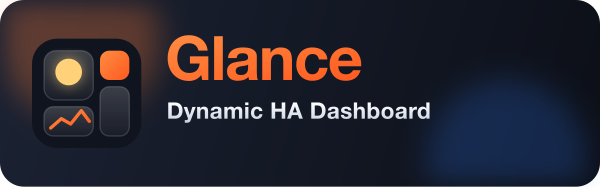
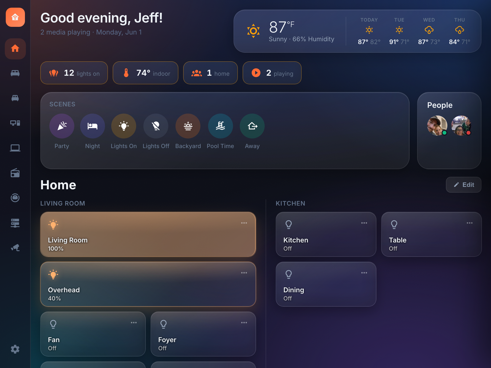
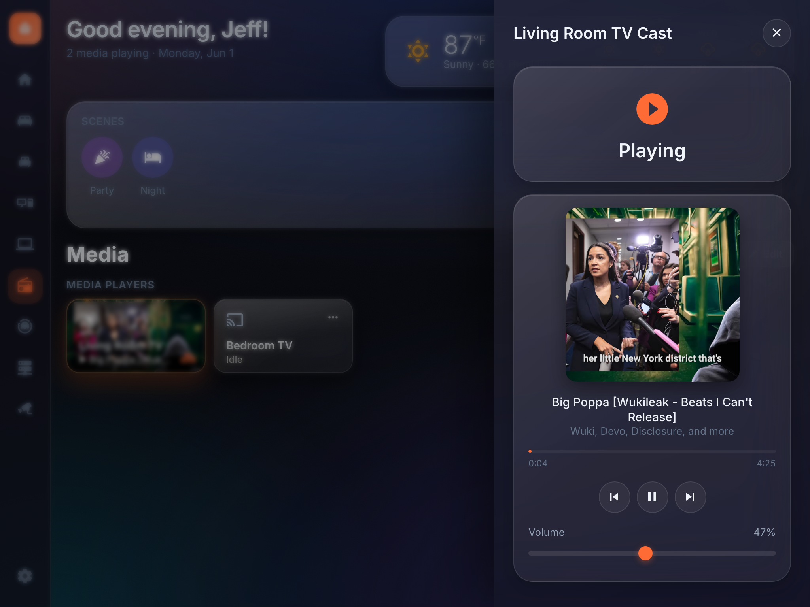
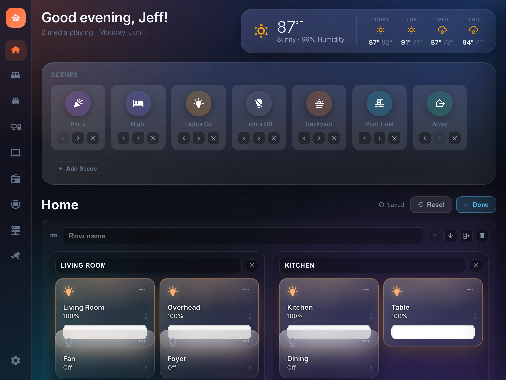
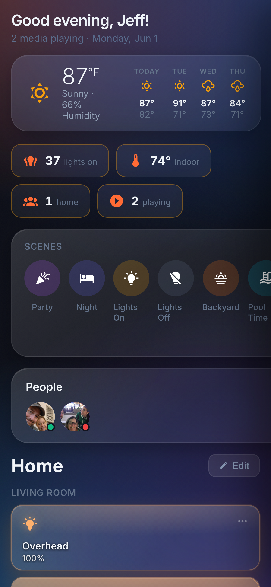

<p align="center">
  
</p>

<h1 align="center">Glance — HA Dashboard</h1>

<p align="center">
  A custom, high-polish <strong>Home Assistant</strong> dashboard — <strong>React 19 + TypeScript + Vite</strong>,
  talking directly to HA over its WebSocket API, with a fully editable tile/room
  layout and a lot of "premium feel" motion and ambient effects.
</p>

<p align="center">
  <a href="https://github.com/jvenuto80/Dynamic-HA-Dashboard/wiki"></a>
  <a href="https://venmo.com/u/jvenuto" target="_blank" rel="noopener noreferrer"></a>
</p>

---

## 📖 Full documentation lives in the Wiki

This README is the quick tour. For step-by-step guides, configuration reference,
architecture, and troubleshooting, head to the **[Glance Wiki](https://github.com/jvenuto80/Dynamic-HA-Dashboard/wiki)**:

| | |
|---|---|
| 🚀 **[Installation](https://github.com/jvenuto80/Dynamic-HA-Dashboard/wiki/Installation)** | Run as an HA add-on or locally; kiosk / direct-port setup |
| ⚙️ **[Configuration](https://github.com/jvenuto80/Dynamic-HA-Dashboard/wiki/Configuration)** | Connect to HA, no-code first-run setup, themes, persistence |
| ✨ **[Features](https://github.com/jvenuto80/Dynamic-HA-Dashboard/wiki/Features)** | Tiles, glance strip, media + Music Assistant, vacuum, ambient |
| 🍳 **[Recipes](https://github.com/jvenuto80/Dynamic-HA-Dashboard/wiki/Recipes)** | Quick how-tos: camera on a tile, reverse a slider, UniFi NOC |
| 🖥️ **[NOC / Servers Dashboard](https://github.com/jvenuto80/Dynamic-HA-Dashboard/wiki/NOC-Servers-Dashboard)** | Infrastructure monitoring board, switch port maps |
| 💾 **[Layout: Backup & Restore](https://github.com/jvenuto80/Dynamic-HA-Dashboard/wiki/Layout-Backup-and-Restore)** | Export/import your dashboard between devices |
| 🏗️ **[Architecture](https://github.com/jvenuto80/Dynamic-HA-Dashboard/wiki/Architecture)** | Source layout, data flow, settings persistence |
| 🛠️ **[Add-on Development](https://github.com/jvenuto80/Dynamic-HA-Dashboard/wiki/Add-on-Development)** | Build, versioning, releasing |
| ❓ **[Troubleshooting / FAQ](https://github.com/jvenuto80/Dynamic-HA-Dashboard/wiki/Troubleshooting)** | Common issues and fixes |
| 🖼️ **[Screenshots & Motion](https://github.com/jvenuto80/Dynamic-HA-Dashboard/wiki/Screenshots)** | The full gallery and animation clips |

---

## Screenshots

| | |
|---|---|
|  |  |
| **Main dashboard** — editable tile/room layout | **Media flyout** — now-playing artwork, scrubber, transport |
|  |  |
| **NOC (servers) board** — nodes, switch **port maps**, alerts | **Edit mode** — drag-and-drop tile arrangement |

The same layout reflows from a full-size wall display down to a phone, where the
sidebar gives way to **swipe navigation**.

<p align="center"></p>

> 🖼️ **[See the full gallery and motion clips →](https://github.com/jvenuto80/Dynamic-HA-Dashboard/wiki/Screenshots)** — light/vacuum/Music-Assistant flyouts, settings, and every ambient backdrop.

**View switching** — staggered tile-entrance cascade


---

## Highlights

- 🧩 **Editable tile / room layout** — drag-and-drop tiles, multiple pages, per-tile settings. No JSON editing. → [Features](https://github.com/jvenuto80/Dynamic-HA-Dashboard/wiki/Features)
- 🎚️ **Rich device controls** — slide-to-dim lights, slide-to-position covers, climate, locks, scenes, scripts.
- 🎵 **Media + Music Assistant** — auto now-playing page, device de-dup, library search and cast. → [Features](https://github.com/jvenuto80/Dynamic-HA-Dashboard/wiki/Features#media--music-assistant)
- 🧹 **Vacuum control center** — live map, room select, suction & mode (built for Dreame, degrades gracefully).
- 🖥️ **NOC monitoring board** — servers, switches, UPSes, Docker, UniFi-style **switch port maps** with PoE power-cycle. → [NOC Dashboard](https://github.com/jvenuto80/Dynamic-HA-Dashboard/wiki/NOC-Servers-Dashboard)
- 🌦️ **Ambient backdrop** — weather-reactive rain/snow, lightning in storms, time-of-day tint.
- 🎨 **Theming** — 4 themes, full accent recolor, configurable date/time & duration formats.
- 🌍 **Six languages** — English, Russian, German, French, Polish & Dutch; switch in **Settings → Appearance → Interface language**, remembered per device.
- 👥 **Zero-config people & weather** — `person.*` and `weather.*` entities are auto-discovered.
- 💾 **Backup & restore** — export your whole dashboard to a portable JSON file. → [Backup & Restore](https://github.com/jvenuto80/Dynamic-HA-Dashboard/wiki/Layout-Backup-and-Restore)
- 📱 **Responsive + kiosk-ready** — wall display to phone, with swipe nav and Fully Kiosk support.
- 🏠 **Runs as a Home Assistant add-on** — Supervisor-managed, served in the sidebar via Ingress.

---

## Quick start

```bash
npm install
npm run dev        # Vite dev server on http://localhost:3000
npm run build      # tsc -b + vite build  → dist/
npm run preview    # serve the production build
```

Strict TypeScript is enforced (`noUnusedLocals`); **the build must be 0 errors.**

Set your connection in the in-app **Settings** modal (HA URL + long-lived token),
or copy `.env.example` → `.env`. Full first-run walkthrough → **[Configuration](https://github.com/jvenuto80/Dynamic-HA-Dashboard/wiki/Configuration)**.

---

## Run as a Home Assistant Add-on

Prefer to run it on the HA server itself? Glance ships as a Supervisor-managed
add-on, served in the sidebar via **Ingress**.

[](https://my.home-assistant.io/redirect/supervisor_add_addon_repository/?repository_url=https%3A%2F%2Fgithub.com%2Fjvenuto80%2FDynamic-HA-Dashboard)

Click the button to add the repository in your own HA, then install **Glance — HA
Dashboard**. Requires a Supervisor (HA OS or Supervised).

> 📘 **Full install guide** — manual steps, kiosk / direct-port access, and updating →
> **[Installation](https://github.com/jvenuto80/Dynamic-HA-Dashboard/wiki/Installation)**. First-time token setup →
> **[Configuration](https://github.com/jvenuto80/Dynamic-HA-Dashboard/wiki/Configuration)**.

---

## Tech stack

React 19.1 · TypeScript ~5.8 (strict) · Vite 6 · `home-assistant-js-websocket` ·
`@dnd-kit` · Material Design Icons · single stylesheet (`src/styles/theme.css`).

More detail → **[Architecture](https://github.com/jvenuto80/Dynamic-HA-Dashboard/wiki/Architecture)**.

---

## Credits

Built and maintained by [@jvenuto80](https://github.com/jvenuto80).

With thanks to community contributors:

- **Translations & multi-language (i18n) support** — English, Russian, German,
  French, Polish & Dutch by [@efimofline](https://github.com/efimofline)
  ([#35](https://github.com/jvenuto80/Dynamic-HA-Dashboard/pull/35),
  [#36](https://github.com/jvenuto80/Dynamic-HA-Dashboard/pull/36)).

---

## License

Copyright (c) 2026 Jeff Venuto. All rights reserved. See [LICENSE](./LICENSE).

You may use, modify, and share this project **for free, with attribution** to the
Owner and a link back to this repository. You may **not sell it** or use it for
commercial gain, and derivatives must keep these same terms.

---

## Support

If this dashboard made your home feel a little more premium, you can say thanks:

<a href="https://venmo.com/u/jvenuto" target="_blank" rel="noopener noreferrer"></a>

> Companion file: [TODO.md](./TODO.md) tracks remaining ideas and decisions.
